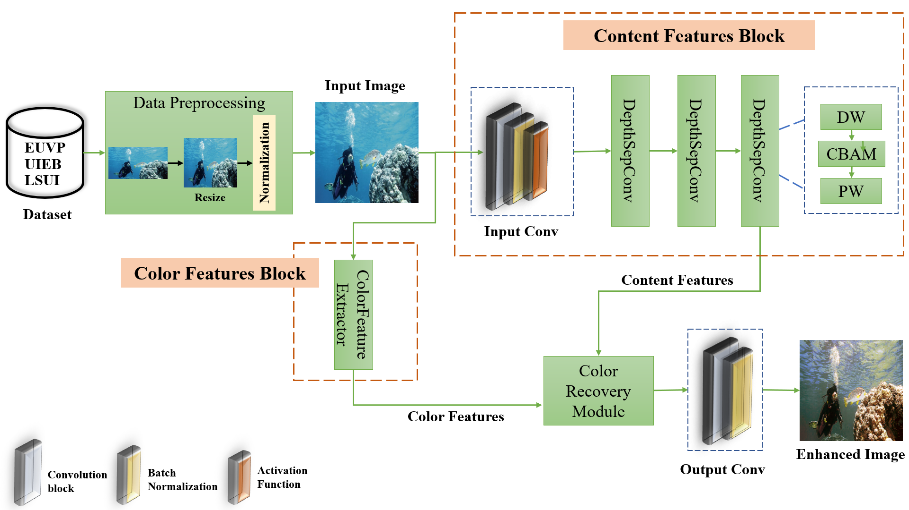
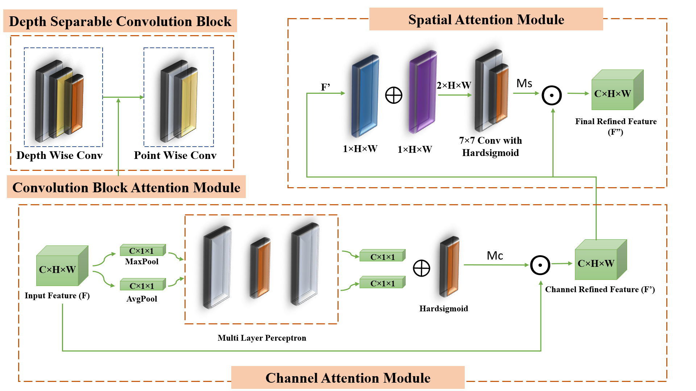
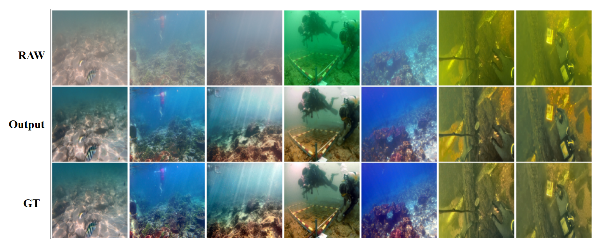

# **A Deep Learning Network for Underwater Image Enhancement**


## **Project Overview**

This project is a lightweight deep learning model designed for **real-time enhancement of single underwater images**, focusing on restoring clarity, contrast, and color in degraded marine visuals. The model is optimized to run efficiently on resource-constrained systems while maintaining high perceptual quality.

It combines **depthwise separable convolutions**, **attention mechanisms (CBAM/SE)**, and optimized **residual connections** to achieve a balance between visual fidelity and computational cost. Applications include marine exploration, AUVs, underwater robotics, and underwater monitoring systems.

---

## **Model Architecture**

### Overall Architecture


* **Backbone**: Lightweight convolutional network
* **Attention**: CBAM modules to refine spatial and channel features
* **Activation**: Hardswish, Hardsigmoid, ReLU for non-linear transformation
* **Loss Functions**: Combination of pixel-wise (MSE), SSIM, perceptual (VGG), and UIQM-based custom losses
* **Framework**: Implemented in PyTorch

### Content Feature Architecture



---

## **Dataset: EUVP, UIEB, LSUI for training and testing the model**

---

## **Evaluation Metrics**

| Metric                                      | Description                                         | Target                           
| ------------------------------------------- | --------------------------------------------------- | --------------------------------
| **SSIM** (Structural Similarity Index)      | Measures structural similarity (texture, luminance) | ↑ Higher is better (0–1)         
| **PSNR** (Peak Signal-to-Noise Ratio)       | Measures noise level in dB                          | ↑ Higher is better (40+ is good) 
| **UIQM** (Underwater Image Quality Measure) | Composite metric for underwater image quality       | ↑ Higher is better               
| **MSE** (Mean Squared Error)                | Pixel-level difference with GT                      | ↓ Lower is better                

---

## **Codebase Structure**

```
LiteEnhanceNet/
│
├── data/                         # Dataset and output enhanced images
├── snapshots/                   # Saved model weights and checkpoints
├── utils/
│   ├── data_utils.py            # Augmentation, normalization
│   ├── imqual_utils.py          # PSNR and SSIM calculations
│   ├── plot_utils.py            # Loss and image plot functions
│   ├── ssim_psnr_utils.py       # SSIM and PSNR helpers
│   ├── uqim_utils.py            # UICM, UISM, UIConM metrics
│
├── wandb/                       # Visualizations using Weights & Biases
├── combined_loss.py            # Total loss calculation
├── dataloader.py               # Dataset loading logic
├── metrics_calculation.py      # Final evaluation metric summary
├── model.py                    # Main model architecture
├── ssim_loss.py                # SSIM loss function
├── vgg_loss.py                 # Perceptual loss using VGG19
├── training.py                 # Model training pipeline
├── test.py                     # Model evaluation and testing
├── uiqm_utils.py               # Enhanced UIQM implementation
```

---

## **Training Details**

```
Framework: PyTorch
Platform: Kaggle Notebook Environment
Hardware: NVIDIA GPU
Input Size: 256×256 
Training details: 
Epoch: 200
Batch size: 8
Optimizer: Adam
Learning Rate: 0.0001 
Loss: L2, SSIM, VGG16
Metrics: PSNR, SSIM, UIQM
```

## **Training the Model**

```bash
python training.py
```

## **Testing the Model**

```bash
python test.py
```

## Result



---

## **Environment**

* Python: `3.8`
* PyTorch: `1.11`
* CUDNN: `8.2`
* NumPy: `1.22`

---

## **Additional Notes**

* **Tensor**: Multi-dimensional array used to represent images for deep learning computations.
* **Pixel Loss (MSE, L1)**: Compares exact pixel values between images.
* **SSIM Loss**: Measures perceptual similarity (lower is better during training).
* **Perceptual (VGG) Loss**: Compares high-level features like edges and patterns using a pretrained VGG19 network.
* **Luminance vs. Contrast**:

  * *Luminance*: Pixel-wise brightness
  * *Contrast*: Brightness difference among groups of pixels
* **UIQM Blocks**:
  A 100×100 image with `window_size=10` will be divided into `10×10=100` blocks. Each block is analyzed for visual quality (contrast, sharpness, colorfulness).

---

